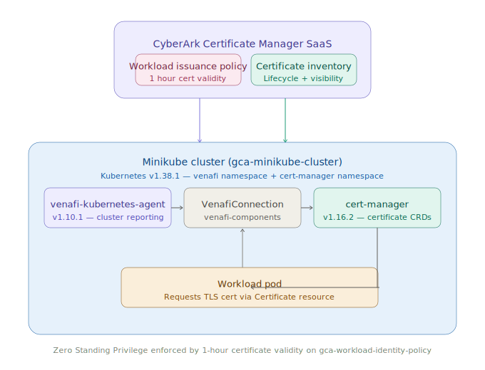
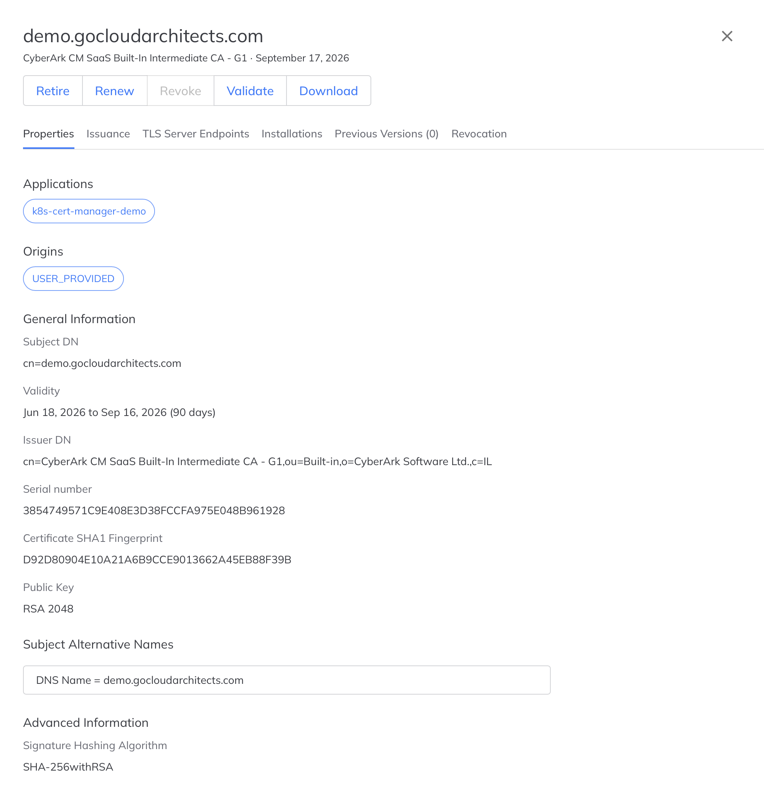
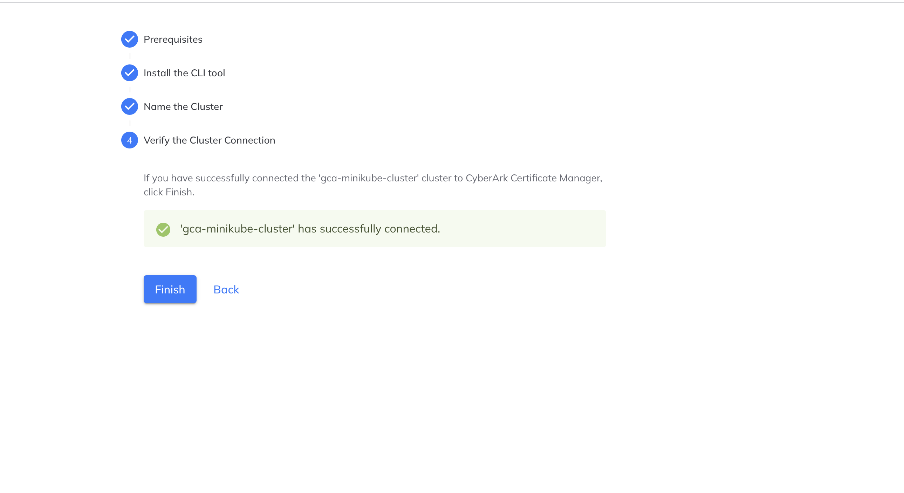
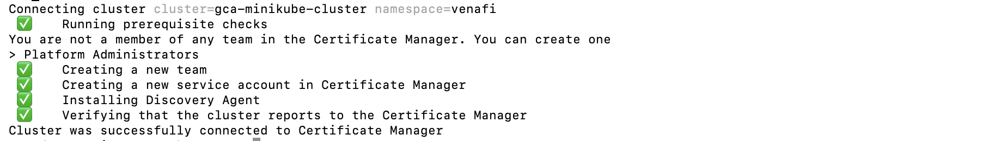
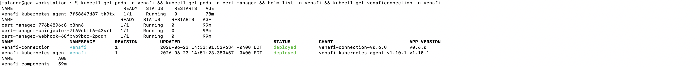
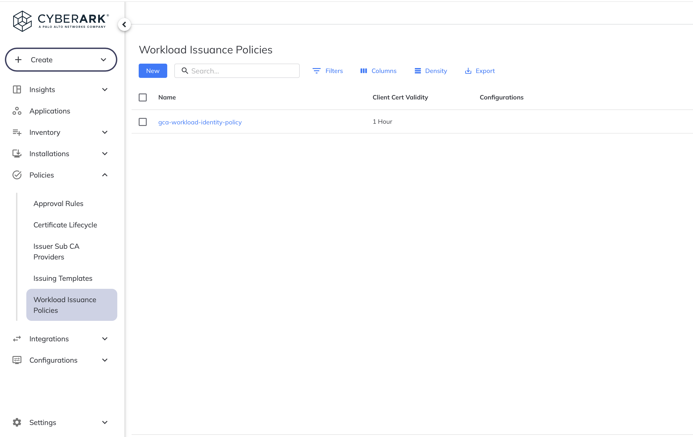
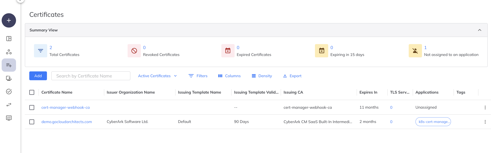

# CyberArk Certificate Manager for Kubernetes + Workload Identity Manager

[](./LICENSE)
[](https://kubernetes.io/)
[](https://www.cyberark.com/products/certificate-manager-for-kubernetes/)

## Executive Summary

Kubernetes has a machine identity problem most organizations don't see until production breaks. Every cluster, every workload, and every DevOps pipeline issues certificates independently with no central inventory, no ownership model, and no expiry visibility. According to a 2026 Palo Alto Networks study, 83% of organizations experienced a certificate-related outage in the past 24 months. The machine-to-human identity ratio has shifted from 10:1 to 43:1 in four years. Most enterprises are still managing this with spreadsheets.

The failure mode is always the same. Long-lived workload certificates outlast the engineers who issued them. Shadow certificates accumulate outside any inventory. When a CA is distrusted or a certificate expires silently, security teams cannot answer the most basic operational question: what in our environment is affected? That answer arrives the same way it always does in unmanaged environments. After something critical stops working.

This architecture was built to solve that. A policy-enforced machine identity lifecycle pattern for Kubernetes workloads using CyberArk Certificate Manager, cert-manager, and centralized Workload Issuance Policies. Workloads receive short-lived certificates with 1-hour validity from a central CA. Zero Standing Privilege enforced at the machine identity layer. Every certificate tracked in a central inventory. Expiry is automatic and by design. No certificate outlasts its workload.

## Overview

This reference implementation deploys CyberArk Certificate Manager for Kubernetes on a Minikube cluster, connects the cluster to CyberArk Certificate Manager SaaS, and configures a Workload Issuance Policy enforcing 1-hour certificate validity. It demonstrates the machine identity lifecycle management pattern for Kubernetes workloads applying Zero Standing Privilege: workloads receive short-lived TLS certificates issued by a central policy-enforced CA, eliminating long-lived credentials and ensuring every certificate expires automatically.

This implementation completes the machine identity lifecycle story across the Go Cloud Architects portfolio: secrets management via Conjur, TLS certificate lifecycle via Certificate Manager, and workload identity policy via Workload Issuance Policies.

## Architecture



### Components

| Component | Version | Role |
|---|---|---|
| Minikube | v1.38.1 | Local Kubernetes cluster |
| cert-manager | v1.16.2 | Certificate CRD management and issuance |
| venafi-connection | v0.6.0 | VenafiConnection CRD linking cluster to SaaS tenant |
| venafi-kubernetes-agent | v1.10.1 | Cluster reporting and certificate discovery |
| CyberArk Certificate Manager SaaS | Cloud | Policy enforcement, inventory, lifecycle management |
| Workload Issuance Policy | gca-workload-identity-policy | 1-hour certificate validity, RSA 2048, Client Auth EKU |

## Prerequisites

- Minikube v1.38.1 or later
- kubectl v1.36.2 or later
- Helm v3.x
- venctl CLI
- CyberArk Certificate Manager SaaS tenant
- Docker Desktop (for Minikube driver)

## Deployment Steps

### 1. Start Minikube

```bash
minikube start --driver=docker
```

### 2. Install cert-manager

```bash
helm repo add jetstack https://charts.jetstack.io
helm repo update
helm install cert-manager jetstack/cert-manager \
  --namespace cert-manager \
  --create-namespace \
  --version v1.16.2 \
  --set crds.enabled=true
```

Verify all pods are running:

```bash
kubectl get pods -n cert-manager
```

### 3. Connect cluster to CyberArk Certificate Manager SaaS

Install venctl and connect the cluster:

```bash
venctl components kubernetes agent connect \
  --name gca-minikube-cluster \
  --namespace venafi \
  --api-key <YOUR_API_KEY> \
  --venafi-cloud
```

Verify the venafi-kubernetes-agent pod is running:

```bash
kubectl get pods -n venafi
```

### 4. Install venafi-connection CRD

```bash
helm repo add venafi-charts https://charts.jetstack.io
helm repo update
helm install venafi-connection \
  oci://registry.venafi.cloud/charts/venafi-connection \
  --namespace venafi \
  --version v0.6.0
```

### 5. Create the API key secret

```bash
kubectl create secret generic venafi-credentials \
  --namespace venafi \
  --from-literal=apiKey=<YOUR_API_KEY>
```

### 6. Deploy the VenafiConnection object

```bash
kubectl apply -f manifests/venaficonnection.yaml
```

### 7. Create the Workload Issuance Policy

In the CyberArk Certificate Manager SaaS console navigate to Policies > Workload Issuance Policies and create a policy with the following settings:

- Name: `gca-workload-identity-policy`
- Client Cert Validity: 1 Hour
- Key Algorithm: RSA
- Key Usage: Digital Signature
- Extended Key Usage: Client Authentication

### 8. Deploy a test certificate

```bash
kubectl apply -f manifests/certificate.yaml
```

Verify the certificate was issued:

```bash
kubectl get certificate -n venafi
```

## Screenshots

### 1. Cluster connect terminal output

All prerequisite checks passed, venafi-kubernetes-agent installed, cluster successfully connected to Certificate Manager.



### 2. Cluster connect console confirmation

CyberArk Certificate Manager SaaS confirming `gca-minikube-cluster` successfully connected through the guided setup wizard.



### 3. Certificate detail demo.gocloudarchitects.com

Certificate issued by CyberArk CM SaaS Built-In Intermediate CA, RSA 2048, SHA-256withRSA, assigned to application `k8s-cert-manager-demo`, validity 90 days, SAN confirmed.



### 4. Certificate inventory Summary View

Active certificate inventory showing 2 certificates, 0 revoked, 0 expired. `demo.gocloudarchitects.com` issued by CyberArk CM SaaS and tagged `k8s-cert-manager-demo`.



### 5. Workload Issuance Policy

`gca-workload-identity-policy` configured with 1-hour Client Cert Validity, enforcing Zero Standing Privilege for workload certificate issuance.



### 6. Kubernetes components running state

All pods Running: venafi-kubernetes-agent, cert-manager, cert-manager-cainjector, cert-manager-webhook. Helm releases deployed. VenafiConnection object confirmed.



## Design Principles

**Centralized policy enforcement over per-cluster issuers.** A Workload Issuance Policy defined once in CyberArk Certificate Manager SaaS applies to every connected cluster without per-cluster configuration. New clusters inherit governance controls at connection time. Policy drift across clusters is structurally prevented.

**Short certificate validity as the ZSP control.** The 1-hour certificate validity period is not a configuration choice. It is the Zero Standing Privilege enforcement mechanism at the machine identity layer. A workload credential that expires in one hour cannot be exploited for longer than one hour. cert-manager handles automated renewal transparently. The workload sees no disruption. The attacker sees a credential that expires before they can operationalize it.

**cert-manager as the Kubernetes-native issuance layer.** cert-manager handles Certificate CRDs, manages the renewal lifecycle, and integrates natively with Kubernetes workloads. CyberArk Certificate Manager SaaS owns the policy enforcement and inventory visibility. Each layer does what it is designed to do.

**Inventory visibility as a governance requirement.** Every certificate issued through this architecture appears in the CyberArk Certificate Manager SaaS inventory with issuance date, expiry, issuing CA, and application assignment. Certificate sprawl is structurally prevented by routing all issuance through the central CA.

## Business Impact

The business case for centralized certificate lifecycle management is operational resilience, compliance readiness, and the elimination of certificate-related outages.

Certificate-related outages are among the most preventable disruptions in enterprise infrastructure. A 2026 Palo Alto Networks study found 83% of organizations experienced a certificate-related outage in the past 24 months. Every one of those outages was caused by a certificate that expired without detection because it was outside any inventory. Centralized issuance through CyberArk Certificate Manager SaaS means every certificate is tracked, every expiry is visible, and renewal is automated before the expiry window closes.

The compliance case is machine identity governance. FFIEC, PCI-DSS, and SOX ITGC all require that cryptographic controls be managed and auditable. A certificate inventory that shows every workload certificate, its issuing CA, its validity period, and its application assignment is the audit evidence those frameworks require.

The security case is ZSP at the machine identity layer. Long-lived workload certificates are the machine identity equivalent of standing privilege. A certificate valid for 90 days that is compromised on day one provides 89 days of exploitation window. A certificate valid for one hour provides at most one hour. The 1-hour Workload Issuance Policy reduces the blast radius of any workload identity compromise to the smallest operationally viable window.

## Enterprise Considerations

This reference implementation runs on a single Minikube cluster. Organizations deploying this architecture at enterprise scale should address the following.

**Multi-cluster deployment**
The venafi-kubernetes-agent and VenafiConnection pattern is designed to scale horizontally. Each cluster connects independently to the CyberArk Certificate Manager SaaS tenant and inherits the same Workload Issuance Policy without per-cluster policy configuration. Certificate inventory across all clusters is aggregated in a single SaaS tenant view. New clusters inherit governance controls at connection time.

**High availability**
cert-manager should be deployed with multiple replicas across availability zones. The venafi-kubernetes-agent operates in a degraded mode if SaaS connectivity is interrupted existing certificates continue serving traffic until expiry. Renewal failures should trigger alerting before the renewBefore window closes.

**Disaster recovery**
Certificate private keys are stored in Kubernetes secrets within the cluster. DR planning must include secret backup and restore procedures. In a full cluster rebuild scenario, cert-manager re-requests and re-issues all certificates automatically on startup provided SaaS connectivity is available.

**RBAC and operational ownership**
Certificate resource creation should be restricted by namespace-scoped RBAC. Platform engineering owns the VenafiConnection and Workload Issuance Policy configuration. Application teams consume certificates via Certificate resources within their namespaces. Security owns the SaaS tenant policy definitions and audit review.

**Audit and compliance reporting**
The CyberArk Certificate Manager SaaS inventory provides a centralized audit record of every certificate issued, renewed, and revoked across all connected clusters. This record satisfies SOX ITGC, FFIEC, and PCI-DSS audit evidence requirements without additional tooling.

**Certificate validity at scale**
The 47-day maximum TLS validity period takes effect in March 2026 per CA/Browser Forum Ballot SC-081v3. Organizations still managing certificate renewals manually are already past the tipping point. Automated policy-enforced issuance is the only operationally viable model at enterprise cluster counts.

## Compliance Mapping

| Control | Framework | Implementation |
|---|---|---|
| Short-lived credentials | Zero Standing Privilege | 1-hour certificate validity on gca-workload-identity-policy |
| Certificate lifecycle management | NIST CSF PR.AC-1 | CyberArk CM SaaS inventory with auto-expiry tracking |
| Non-human identity governance | FFIEC IT Examination Handbook | Machine identity policy enforced at issuance, not runtime |
| Cryptographic controls | PCI-DSS Requirement 4 | RSA 2048, SHA-256withRSA, TLS enforced for workload communication |
| Audit trail | SOX ITGC | Certificate inventory with issuance history, expiry, and revocation tracking |
| Workload authentication | NIST SP 800-207 Zero Trust | Certificate-based mutual authentication replacing static credentials |

## License

© 2026 Go Cloud Architects — [AGPL-3.0](./LICENSE)

Contact: curtis@igasecurityconsulting.com
